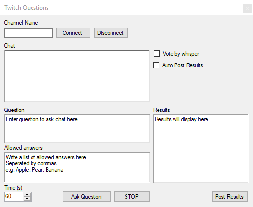

# Twitch-Questions
Tool that allows twitch chat to vote on questions

# How to use
- Download the exe and json files from the release page [HERE](https://github.com/Ryason/Twitch-Questions/releases/tag/v0.03)
- The Secrets.json file needs to be in the same directory as the .exe
- Open the json file with a text editor
- Add your Access token from https://twitchtokengenerator.com to the BOT_ACCESS_TOKEN part of the json file
- Add the channel name associated with the access token to the BOT_CHANNEL_NAME part of the json file
- Run the .exe
- Enter the channel name you want to run the poll on into the input field
- Press the "Connect" button
- You will see "Connceted to [channel_name]" if the client has connected correctly 
- Write a question in the question box
- In the allowed answers box, write a list of allowed answers for twitch chat to vote on. This list must be seperated by commas
- Set the duraton of time allowed to vote
- Select whether you want to auto post results to chat, and if you want voting to be done through whispering the bot
- Once setup, click the "Ask Question" button
- The account linked to the access token will post the question in chat and give voting options.
- Users can only vote once
- If the poll needs to be cancelled early, click the "STOP" button.
- If you decide you want to post results to chat, you can press the "Post Results" button at any time.
- The bot will post a message in chat once the allowed voting time has passed, if auto post results is enabled

